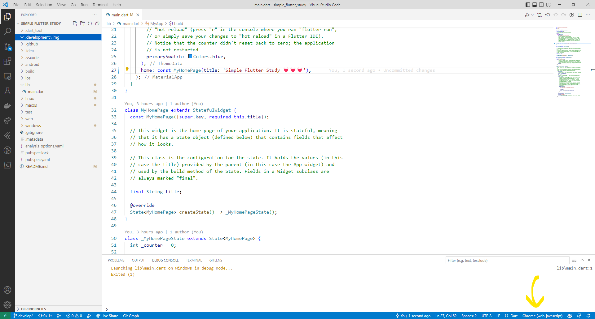

# simple_flutter_template_web

Flutter(Web)の学習用プロジェクト。  
Web作成用のGitHub Actionsファイル作成と基本動作の確認が目的。  

## 実行方法

```shell
flutter build web
```

デバグ用はVSCodeでF5キーで実行可能。  

対象となるプラットフォームはステータスバーから変更可能。  
Chromeを選択する。  

  

## 自分用メモ

```shell
# プロジェクトの作成
flutter create ☆プロジェクト名☆
# VSCodeのFlutter拡張機能の「Flutter: New Project」でもOK(コマンドパレット)
```

## 参考文献

- [公式ドキュメント](https://docs.flutter.dev/get-started/install)
- [kazutxtさんの記事](https://zenn.dev/kazutxt/books/flutter_practice_introduction/viewer/01_chapter0_aboutme)
